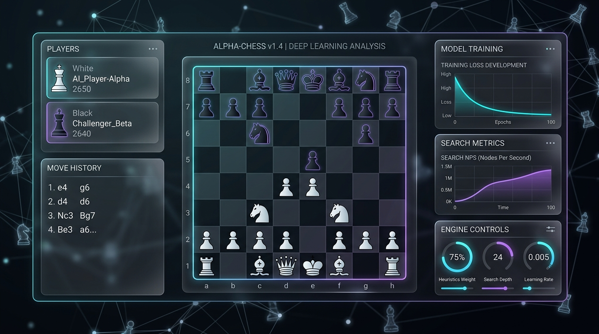
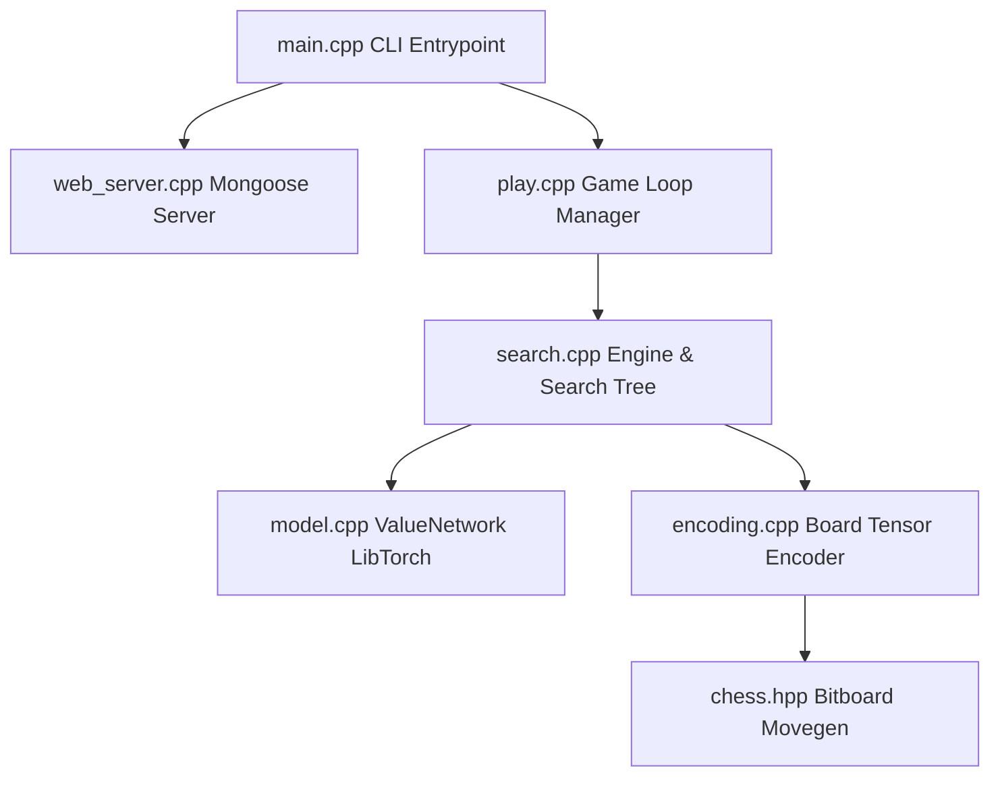

# Causal Chess

A high-performance C++ chess engine that utilizes a Deep Convolutional Neural Network (CNN) value function and trains it **during search** using online Temporal Difference (TD) learning. 

Rather than relying on traditional brute-force Alpha-Beta minimax search or offline training pipelines, Causal Chess learns directly from its own search tree computations in real-time, dynamically adjusting its evaluation network to align with minimax valuations.

---

## 1. Project Overview

Causal Chess features a modern, responsive web dashboard that visualizes training metrics, search analytics (such as Nodes Per Second, NPS), and the actual and "thinking" board states of the engine.



### Key Features
- **In-Situ Online learning**: The evaluation network is trained concurrently during search using Temporal Difference updates on all traversed tree nodes.
- **Selective Tree Search**: Replaces brute-force search with selective expansion using dynamic, depth-based move pruning (`top_n`).
- **Hybrid Heuristic Blending**: Leverages a combination of the deep neural network prediction and a handcrafted heuristic (composed of material, space control, and degree-of-freedom mobility) that smoothly transitions importance as the network converges.
- **Dynamic Parameter Tuning**: Incorporates automatic, runtime-adaptive learning rate scaling, scheduler decays, and divergence-based heuristic weight annealing.

---

## 2. Installation Instructions

### Prerequisites
To build and run the Causal Chess engine, you need:
- **C++17 Compatible Compiler** (e.g., GCC >= 9, Clang >= 10, or MSVC)
- **CMake** (version >= 3.18)
- **Ninja** (recommended build system tool)
- **LibTorch** (PyTorch C++ distribution, matching your system's CUDA/CPU requirements)

### Step 1: Install LibTorch
Download the LibTorch C++ zip from [pytorch.org](https://pytorch.org/). Unzip it to a convenient directory.

Alternatively, on macOS with Homebrew, you can install PyTorch globally:
```bash
brew install pytorch
```

### Step 2: Clone and Compile the Project
Configure and compile the project using CMake and Ninja:

```bash
mkdir build
cd build
# Point CMake to your LibTorch installation directory if not globally available
cmake -DCMAKE_PREFIX_PATH=/path/to/libtorch -G Ninja ..
ninja
```

This will produce two executables inside the `build` directory:
- `causal-chess-cpp`: The main application (CLI and web server).
- `causal-chess-tests`: The unit testing suite.

### Step 3: Run the Unit Tests
Execute the unit testing suite to verify the installation:
```bash
./causal-chess-tests
```

### Step 4: Launch the Web UI
Start the self-play training loop with the Web server active (defaulting to port `8080`):
```bash
./causal-chess-cpp play
```
Open your web browser and navigate to `http://localhost:8080` to access the interactive web interface.

---

## 3. Configuration Hints

Causal Chess provides extensive options via CLI arguments and the Web interface. You can view all options by running:
```bash
./causal-chess-cpp play --help
```

### Key Parameters
- `--depth <n>` (default: `4`): The maximum search depth of the selective tree search.
- `--top-n <val>` (default: `5`): Moves to expand per node. Can be specified as a single integer (constant width) or a comma-separated list matching the search depth (e.g., `5,4,3,2` for tapered branchiness).
- `--heuristic-weight <val>` (default: `0.5`): Initial weight $w$ given to the handcrafted evaluation.
- `--adaptive-weight-smoothing <val>` (default: `0.8`): The smoothing factor $\alpha$ for the adaptive heuristic weight controller.
- `--lr <val>` (default: `1e-4`): The base learning rate.
- `--adaptive-scaling`: Flag to enable dynamic scaling of post-game training epochs and live learning rates based on training stability.

---

## 4. Software Architecture & Tooling

The application is structured into modular C++ files designed to minimize latency:



- **Bitboard Engine**: Embedded via `src/third_party/chess.hpp` (a header-only C++ Chess library), providing high-performance move generation.
- **Deep Learning Subsystem**: Handled via LibTorch (PyTorch C++ API). Model parameters are loaded directly onto the target device (CPU, MPS, or CUDA).
- **Web UI & Networking**: Built with Mongoose (embedded C/C++ networking library) communicating with a HTML5/JS frontend via WebSockets. The client uses Chart.js to render realtime telemetry graphs.

---

## 5. Algorithmic Foundation & Deep Learning Interaction

### Board Representation Encoding
A given chess position is mapped to a tensor $X \in \mathbb{R}^{15 \times 8 \times 8}$ using 15 channels:
- **Planes 0–5**: Binary planes representing White pieces (Pawns, Knights, Bishops, Rooks, Queens, King).
- **Planes 6–11**: Binary planes representing Black pieces (Pawns, Knights, Bishops, Rooks, Queens, King).
- **Plane 12**: Side to move plane (all $1.0$ if White's turn, all $0.0$ if Black's turn).
- **Planes 13–14**: Castling rights for White and Black respectively (set to $1.0$ at rook squares).

### Value Function Architecture
The value network $V_{\theta}(s) \in [0, 1]$ represents the win probability for White. The network architecture consists of:
1. **5 Convolutional Layers**: $3 \times 3$ filters, padding $1$, utilizing ReLU activation functions, progressing from $15 \rightarrow 64 \rightarrow 128$ channels.
2. **Adaptive Average Pooling**: Downsamples spatial dimensions to $(128, 1, 1)$.
3. **Multi-layer Perceptron (MLP)**: Flatten $\rightarrow$ Linear(128, 64) $\rightarrow$ ReLU $\rightarrow$ Linear(64, 1) $\rightarrow$ Sigmoid.

### Blended Leaf Evaluation
At the leaf nodes of the search tree (depth $=0$), the score is evaluated by blending the neural network output with a handcrafted evaluation:

$$V(s) = (1 - w) \cdot V_{\theta}(s) + w \cdot H(s)$$

Where the handcrafted evaluation $H(s)$ is maps to $[0, 1]$ via the hyperbolic tangent:

$$H(s) = \frac{1}{2} + \frac{1}{2} \tanh \left( \frac{\text{material\_diff} + 0.1 \cdot \text{space\_diff} + 0.05 \cdot \text{move\_count\_diff}}{8.0} \right)$$

- **$\text{material\_diff}$**: Computed dynamically via a Quiescence Search using standard piece values (P=1, N=3, B=3, R=5, Q=9).
- **$\text{space\_diff}$**: Centroid-weighted square attacks multiplied by a phase factor.
- **$\text{move\_count\_diff}$**: The degree-of-freedom difference representing mobility: White's possible legal moves minus Black's possible legal moves.

### Online Temporal Difference (TD) Learning
During tree search, each node $s$ evaluates its children $s_i$. The minimax value is computed as:

$$V(s) = \begin{cases} 
\max_{m_i} V(s_i) & \text{if White to move} \\
\min_{m_i} V(s_i) & \text{if Black to move}
\end{cases}$$

An online optimization step is immediately performed. To double the training data and enforce horizontal symmetry, we stack the original board tensor $X_s$ and its mirrored counterpart $X_{s,\text{mirror}}$ along the batch dimension:

$$L(\theta) = \frac{1}{2} \sum_{X \in \{X_s, X_{s,\text{mirror}}\}} \left( V_{\theta}(X) - V(s) \right)^2$$

Parameters are updated using the Adam optimizer with gradient clipping to prevent explosion.

### Dynamic Tuning & Adaptive Controllers
- **Heuristic Weight Annealing**: To smoothly transition from handcrafted rules to pure deep learning, the heuristic weight $w$ is updated after each game based on the divergence between the neural network and the heuristic:
  
  $$w_{t+1} = \alpha \cdot w_t + (1 - \alpha) \cdot \min\left(w_t, w_{\text{initial}} \cdot \max\left(0, \min\left(1, \frac{\text{avg\_div}}{0.15}\right)\right)\right)$$

- **Hybrid Runtime-Adaptive Scaling**: Adjusts the post-game training epochs and live learning rate multiplier dynamically based on the ratio of online TD updates to post-game outcome training steps.

---

## 6. References to Previous Work

1. **TD-Gammon (Tesauro, 1995)**: Pioneered temporal difference learning ($\text{TD}(\lambda)$) in games, demonstrating that neural networks can learn expert-level valuation functions through self-play.
2. **TD-Search (Baxter et al., 2000)**: Introduced the integration of temporal difference updates directly into minimax search trees.
3. **Giraffe (Lai, 2015)**: Showed that deep reinforcement learning could be applied to chess using a neural network evaluator with raw features, predicting values similar to TD methods.
4. **AlphaZero (Silver et al., 2017)**: The state-of-the-art framework for learning board games entirely from scratch using Monte Carlo Tree Search (MCTS) and self-play.

---

## 7. Development Partnership

This project was built and optimized through a pair-programming collaboration between the user and **Antigravity**, a powerful agentic AI coding assistant designed by the Google DeepMind team.
